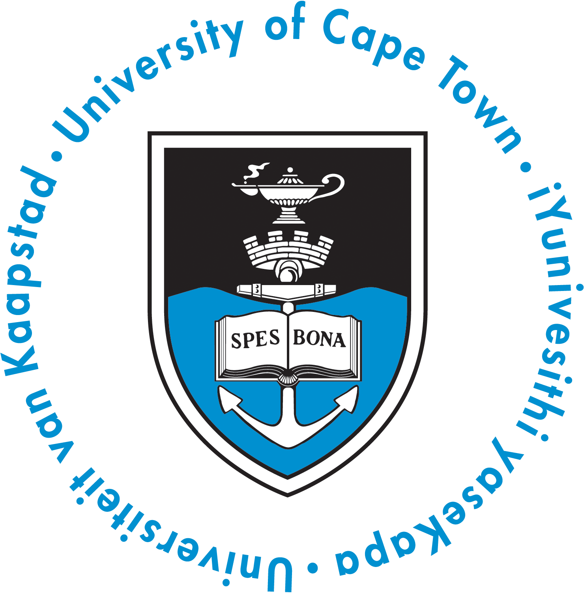

## Hi there 👋 

I'm an Electrical and Computer Engineering student at the [University of Cape Town](https://www.uct.ac.za/research-innovation/rankings)

- I am currently working on a machine learning competition: Predicting job application success [Kaggle Challenge](https://www.kaggle.com/competitions/south-african-opportunity-prediction-challenge/overview)
- Open to collaborate on anything DATA Science!!!
- Passionate about data modeling and Electrical Engineering
- A lover of Open Source Projects❤️

## 🌐 Connect With Me

### My skills 

